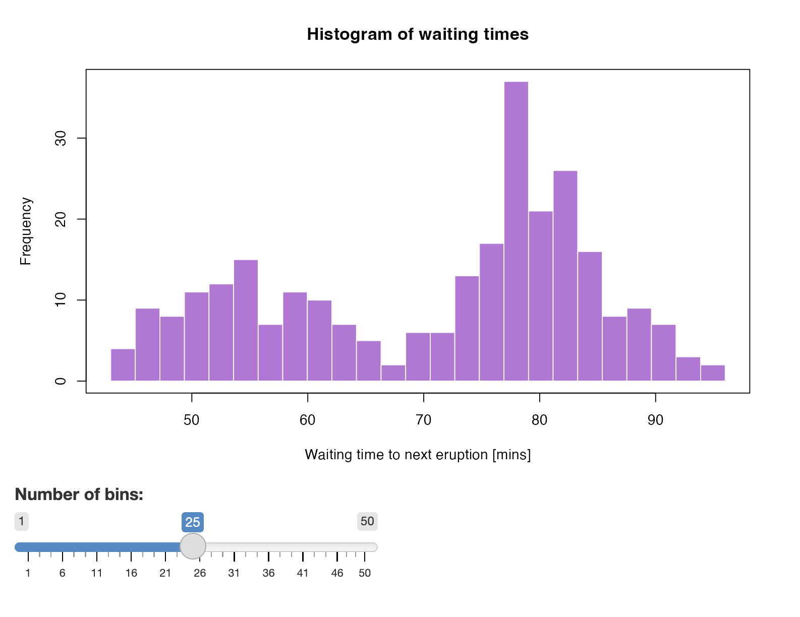

# Hello Shiny App

Shiny app displaying the histogram of the Old Faithful geyser waiting times.



| Flavour           | Link  | Image  |
|-------------------|---|---|
| R Shiny           | [`r-shiny`](./r-shiny/)  | [`ghcr.io/h10y/faithful/r-shiny`](https://github.com/h10y/faithful/pkgs/container/faithful%2Fr-shiny)  |
| Python Shiny      | [`py-shiny`](./py-shiny/)  | [`ghcr.io/h10y/faithful/py-shiny`](https://github.com/h10y/faithful/pkgs/container/faithful%2Fpy-shiny)  |
|  R Shiny as a Rhino app   |  [`r-rhino`](./r-rhino/)   |  [`ghcr.io/h10y/faithful/r-rhino`](https://github.com/h10y/faithful/pkgs/container/faithful%2Fr-rhino)   |

## Shiny in an R package

| Flavour           | Link  | Image  |
|-------------------|---|---|
|  R package   |   [`r-package`](./r-package/)  |  [`ghcr.io/h10y/faithful/r-package`](https://github.com/h10y/faithful/pkgs/container/faithful%2Fr-package)   |
|  Golem   |  [`r-golem`](./r-golem/)   |  [`ghcr.io/h10y/faithful/r-golem`](https://github.com/h10y/faithful/pkgs/container/faithful%2Fr-golem)   |
|  Leprechaun   |  [`r-leprechaun`](./r-leprechaun/)   |  [`ghcr.io/h10y/faithful/r-leprechaun`](https://github.com/h10y/faithful/pkgs/container/faithful%2Fr-leprechaun)   |

## Dynamic documents

| Flavour           | Link  | Image  |
|-------------------|---|---|
|  R Markdown with Shiny  |  [`rmd-shiny`](./rmd-shiny/)  |  [`ghcr.io/h10y/faithful/rmd-shiny`](https://github.com/h10y/faithful/pkgs/container/faithful%2Frmd-shiny)  |
|  Prerendered R Markdown  |  [`rmd-prerendered`](./rmd-prerendered/)  |  [`ghcr.io/h10y/faithful/rmd-prerendered`](https://github.com/h10y/faithful/pkgs/container/faithful%2Frmd-prerendered)  |
|  Quarto with R Shiny (single file)  |  [`quarto-r-shiny`](./quarto-r-shiny/)  |  [`ghcr.io/h10y/faithful/quarto-r-shiny`](https://github.com/h10y/faithful/pkgs/container/faithful%2Fquarto-r-shiny)  |
|  Quarto with R Shiny (multiple files)  |  [`quarto-r-shiny-multifile`](./quarto-r-shiny-multifile/)  |  [`ghcr.io/h10y/faithful/quarto-r-shiny-multifile`](https://github.com/h10y/faithful/pkgs/container/faithful%2Fquarto-r-shiny-multifile)  |
|  Quarto with Python Shiny  |  [`quarto-py-shiny`](./quarto-py-shiny/)  |  [`ghcr.io/h10y/faithful/quarto-py-shiny`](https://github.com/h10y/faithful/pkgs/container/faithful%2Fquarto-py-shiny)  |

## Shinylive

| Flavour           | Link  | Deployment  |
|-------------------|---|---|
|  Python Shinylive  |  [`py-shinylive`](./py-shinylive/)  |  <https://h10y.github.io/faithful/py-shinylive>  |
|  R Shinylive  |  [`r-shinylive`](./r-shinylive/)  |  <https://h10y.github.io/faithful/r-shinylive>  |
|  Quarto with Shinylive (Python)  |  [`quarto-py-shinylive`](./quarto-py-shinylive/)  |  <https://h10y.github.io/faithful/quarto-py-shinylive>  |
|  Quarto with Shinylive (R)  |  [`quarto-r-shinylive`](./quarto-r-shinylive/)  |  <https://h10y.github.io/faithful/quarto-r-shinylive>  |

## Serving Shinylive on GitHub Pages

Serving Shinylive apps on GitHub Pages (from `docs` folder on the `main` branch).

```bash
# Cleanup
rm -rf docs/py-shinylive docs/r-shinylive
rm -rf docs/quarto-py-shinylive docs/quarto-r-shinylive

# Copy files
cp -r r-shinylive/app docs/r-shinylive
cp -r py-shinylive/app docs/py-shinylive
cp -r quarto-r-shinylive/app docs/quarto-r-shinylive
cp -r quarto-py-shinylive/app docs/quarto-py-shinylive

# Render HTML from markdown
pandoc -s -f markdown -t html5 -o "docs/index.html" "index.md"
```

See deployed Shinylive results at <https://h10y.github.io/faithful/>.
